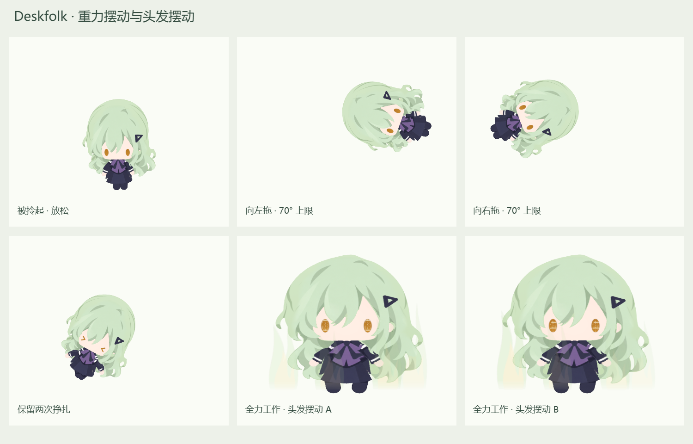

# Companion polish — 0.1.0 / V42

## Changes

- Desktop and tray icons show Mutsumi's head. The 48 × 48 Aseprite master has five editable layers. The previous full-character master and preview are retained under `assets/icons/archive`.
- The **随 Codex 启动** setting defaults to enabled. A small native Windows helper detects the official desktop application's main window and launches the pet. CLI backends and renderer processes do not trigger it.
- The project README and repository description use English. The work feature description is limited to glowing eyes. The previous integration and source-verification introduction sections have been removed.
- Super work gently sways `CTRL_Hair`, including its attached clip, by approximately 1.8° at most. Two combined periods of 1.7 and 2.6 seconds make the motion less repetitive. Existing pose blending fades the sway in and out.
- Dragging uses a damped gravity pendulum around the model's crown. Pointer speed and horizontal displacement drive an opposite-direction tilt, bounded at 70°. Rotation stays in the screen plane; the existing small side angle, hunch, limb poses, and two-effort struggle cycle are preserved.

## Startup behavior

The helper is stored in `%LOCALAPPDATA%\Deskfolk\CodexLauncher`. Its configuration contains only the enabled flag and installed executable path. The current user's `Run` value is named `DeskfolkCodexCompanion`. The helper checks desktop application windows every 750 ms and uses a per-user mutex. Closing the pet manually does not repeatedly relaunch it while the same desktop application process remains open. A subsequent desktop application launch can start it again.

Turning the switch off disables the helper, removes the Run value, and lets the monitor exit. The installer cleans up its own helper and Run value on uninstall, while preserving them during upgrades. Preference saves are serialized so that toggling startup and changing another setting together retain both changes. Configuration writes use the project's Windows replacement fallback, and the native reader tolerates a brief rewrite while allowing rename operations. Development and isolated test profiles do not register startup. Normal preferences and notification history are preserved.

The helper's measured working set during the final launch fixture test was 33,894,400 bytes (about 32.3 MiB). This is an additional background process, without an Electron renderer or network connection.

Implementation references: [Windows Run keys](https://learn.microsoft.com/en-us/windows/win32/setupapi/run-and-runonce-registry-keys) and [Electron nativeImage representations](https://www.electronjs.org/docs/latest/api/native-image).

## Rendering and motion

The rest canvas remains 512 × 512. Drag and its release briefly use a 1024 × 768 canvas at the same world pixel density. Additional transparent space prevents clipping at either 70° limit. The visible model bounds control the native window's screen-edge behavior. The crown's screen position remains stable when the canvas expands, and the canvas returns to its original size after release.

Physics is integrated in substeps no larger than 1/120 second, with spring acceleration 40 and damping 16. Pointer speed is filtered with a 90 ms time constant; drive fades after input stops so gravity returns the pet toward upright. A 0.12-second fast flick peaks at approximately 30° in the deterministic test, and a one-second sustained fast drag reaches approximately 64°. Rendering retains its 60 FPS limit. Model geometry, textures, part scales, working-eye flow, and state observation are unchanged.

## Verification

Results and artifact SHA-256 hashes are in [the verification record](verification/v42-companion-polish.json).

| Check | Result |
| --- | --- |
| Icon resources | Nine ICO sizes: 16, 20, 24, 32, 40, 48, 64, 128, 256; every image found in the built executable |
| Tray DPI | 16 logical pixels at 1×, 1.25×, 1.5×, 2×, 2.5×, and 3×; settings still open through the tray |
| Setting persistence | Default enabled; disable and re-enable persisted through the actual settings UI and IPC in an isolated profile; concurrent startup/scale saves preserved |
| Launcher | Real official desktop detected; new desktop fixture launches pet; duplicates suppressed; disabling stops monitor and prevents launch |
| Configuration compatibility | Startup controller passes enabled/disabled writes with injected Windows rename restrictions; temporary config cleaned |
| Local installation | Updated program, archive, helper, and shortcut icon match the final build; one startup monitor and a responding pet window verified |
| Drag input | Production pointer handler, native press/capture/release; stable screen pivot and restoration to idle |
| Drag bounds | No opaque pixels touching the canvas edge at either ±70° limit |
| Original struggle | Two effort peaks in the existing 4.6-second cycle |
| Model parts | Unit scales preserved; hair sway active only during super work |
| State lifecycle | All 17 existing native-event regression checks passed, including single/multiple projects, pause, completion, stop, recovery, tray, and watering |

Frame timing was measured from 132–133 intervals per state in the final packaged ASAR, using a private profile on this Windows machine. These are short local checks, rather than guarantees for every computer.

| State | Average FPS | Maximum frame interval | Frames over 50 ms |
| --- | ---: | ---: | ---: |
| Idle | 60.00 | 17.4 ms | 0 |
| Work | 59.99 | 17.0 ms | 0 |
| Super work | 60.00 | 16.8 ms | 0 |
| Drag | 60.00 | 18.0 ms | 0 |

The active Codex application was not restarted for the launcher test. Launch/off/duplicate behavior used compiled private desktop and pet fixtures; the real application was checked separately for detection. Local installation checks confirmed the enabled Run registration and native monitor. Electron synthetic mouse events omit screen coordinates, so the input test supplied complete pointer coordinates to the production move handler while retaining native press, capture, and release.

## Relevant files

- Icons: `assets/icons/*`, `assets/icons/archive/*`, `scripts/prepare-head-icon.lua`.
- Startup: `electron/codex-startup.ts`, `scripts/CodexLauncher.cs`, `scripts/build-codex-launcher.cjs`, `scripts/installer-startup.nsh`.
- Preferences and UI: `shared/types.ts`, `electron/main.ts`, `renderer/index.html`, `renderer/main.ts`.
- Animation and layout: `shared/drag-physics.ts`, `renderer/three-rig.ts`, `renderer/style.css`.
- Packaging and export: `package.json`, `scripts/stage-v42-package.mjs`, `scripts/verify-v42-package.mjs`, `scripts/prepare-public-source.py`.
- Checks: `scripts/qa-v42-drag-physics.mjs`, `scripts/qa-v42-companion-polish.cjs`, `scripts/qa-v42-startup-config.cjs`, `scripts/qa-v42-codex-startup.ps1`, and its `.cs` fixture; privacy scanning includes `.cs` and `.nsh` files.
- Introduction: `README.md` and the repository About description.

## Reproduce

Build and stage using the README commands. Run `node scripts/qa-v42-drag-physics.mjs` for deterministic physics checks and `powershell -NoProfile -ExecutionPolicy Bypass -File scripts/qa-v42-codex-startup.ps1` for the isolated native launcher test. Run the packaged renderer checks with Electron and `QA_APP_MAIN` pointing to the built ASAR's `out/main/index.js`; the test sets a private profile and disables startup registration.

## Rollback

The previous tracked source is commit `3149e44e9f69935ca60f94c162fab13861951bbb`. Existing icon masters are also available in `assets/icons/archive`. The local pre-change source and changed installed/runtime files are retained in `.cache/companion-polish-backup-20260928-193823`; its private deployment record lists files and prior hashes.

To restore the earlier application, first turn off **随 Codex 启动**, exit the pet, then restore backed-up runtime files and shortcuts or reinstall the previous installer. Keep the current source checkout or create a separate checkout at the rollback commit before rebuilding, so that subsequent edits are preserved. Personal preference/history files and the existing Blender/Krita/Aseprite model sources were not replaced.
