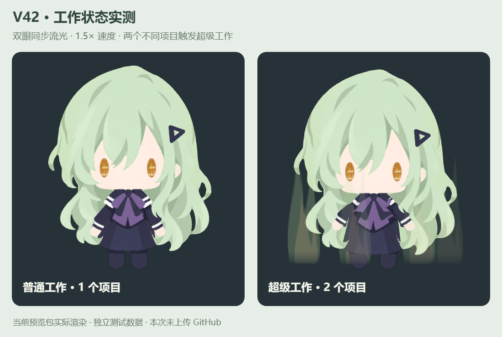

# V42 图标与同步工作流光

日期：2026-09-28。沿用公开版本 `0.1.0` 与内部标记 V42。

## 若叶睦像素图标

采用用户确认的像素初稿：浅绿头发、金色长条眼睛和深色三角发卡。以 48 × 48 透明画布保留可编辑的 Aseprite 源稿；用于 Windows 应用、桌面快捷方式与托盘图标。

| 资源 | 仓库路径 | 尺寸 |
| --- | --- | --- |
| 可编辑源稿 | `assets/icons/mutsumi-icon.aseprite` | 48 × 48 |
| 批准的像素稿 | `assets/icons/icon-48.png` | 48 × 48 |
| Windows 图标 | `assets/icons/deskfolk.ico` | 16、20、24、32、40、48、64、128、256 px |
| 托盘基准 | `assets/icons/tray.png` | 16 × 16 |
| 托盘高 DPI | `tray@1.25x.png`、`tray@1.5x.png`、`tray@2x.png`、`tray@2.5x.png`、`tray@3x.png`，均位于 `assets/icons` | 20、24、32、40、48 px |

托盘逻辑大小为 **16 DIP**，各缩放档使用对应物理像素尺寸；保持与原托盘图标相近的显示大小。桌面快捷方式使用多尺寸 ICO，由 Windows 根据图标大小与显示缩放选择合适图像。

正式 ASAR 中的六档托盘图片均已核验：逻辑尺寸始终为 16 DIP，物理尺寸分别为 16、20、24、32、40、48 像素，均包含透明与可见像素。生产托盘右键处理器可正常打开设置页面。Windows EXE 中的九个 ICO 表示与 Aseprite 导出的 PNG 字节一致。

新版渲染器的 15 个文件与此前已确认的本机双眼同步版本逐字节一致；工作状态、疑惑回复、暂停／完成、浇水恢复和托盘设置的最终包 17 项原生日志集成检查全部通过。测试使用独立日志夹具，不读取真实聊天。

## 双眼流光

仅调整工作眼部绘制：双眼使用相同种子、相位和时间，代码字符与渐隐光带均以原速度的 **1.5 倍**播放。普通工作和超级工作共用该效果，保留金色眼形和现有视线逻辑。

减少动画模式继续保留实时工作眼部指示。此次不调整模型、身体动作、项目计数或 Codex 状态接口。

### 像素与时间验证

在生产渲染器中分别检查 `work` 与 `power-work`，每种动作采样 6 个时刻，共 **12 项**检查：

- 新版左右眼画布逐像素相同。
- 新版时刻 `t` 的眼部画布，与修改前左眼时刻 `1.5 × t` 的画布逐像素相同。
- 采样时刻为 0.05、0.40、0.80、1.23、2.10、3.37 秒，12 项均通过。

默认、系统减少动画、应用减少动画、恢复默认共 4 种模式，每种采样 9 次，共 **36 个样本**；双眼保持同步，流光持续变化。系统减少动画通过测试窗口模拟，未修改系统设置。

## 多项目状态验证

使用独立测试配置，向生产包实际的本地桥接发送**虚拟项目事件**，经过桥接、IPC 与桌宠渲染器验证。此测试不是同时运行多个真实 Codex 编码任务；虚拟目录只用于检验项目归并和动作切换。

| 测试步骤 | 不同工作项目数 | 实际动作 | 结果 |
| --- | ---: | --- | --- |
| 启动 | 0 | `idle` | 通过 |
| 一个项目开始 | 1 | `work` | 通过 |
| 同目录再开一个会话 | 1 | `work` | 通过 |
| 第二个不同项目开始 | 2 | `power-work` | 通过 |
| 第三个不同项目开始 | 3 | `power-work` | 通过 |
| 三个项目降为两个 | 2 | `power-work` | 通过 |
| 两个项目降为一个 | 1 | `work` | 通过 |
| 同目录两个会话之一结束 | 1 | `work` | 通过 |
| 所有项目结束 | 0 | `idle` | 通过 |

超级工作在至少两个不同项目目录工作时触发，保留现有扎马步姿势与半透明火焰气场。退出依据明确的测试结束或中断事件；未加入固定超时推断。

以下对照图来自上述虚拟事件驱动的生产渲染器，左侧为一个项目普通工作，右侧为两个项目超级工作。两侧采用相同的深色背景便于观察半透明气场。图片记录的是发布前本机验证时的状态。

## 回退

使用本次修改之前的 Git 提交重新构建即可恢复旧图标和流光。可编辑 Aseprite 源稿保留在仓库；本机回退副本、测试配置与临时桥接认证信息不进入仓库或发布包。
